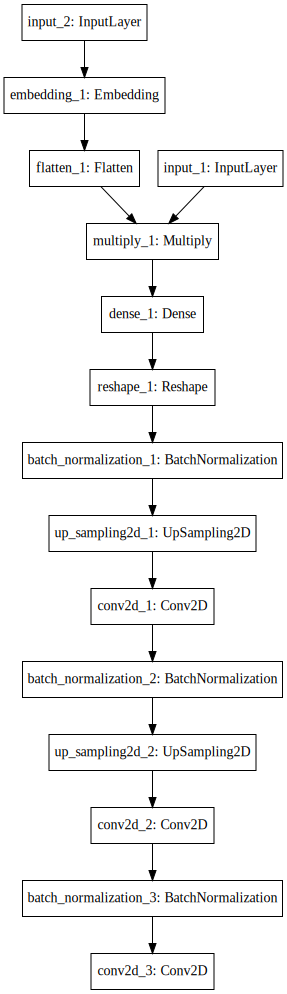
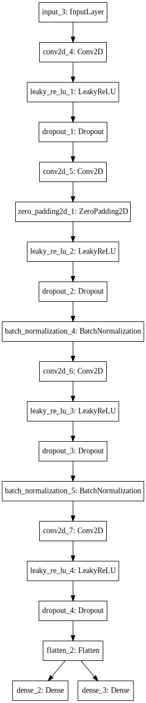
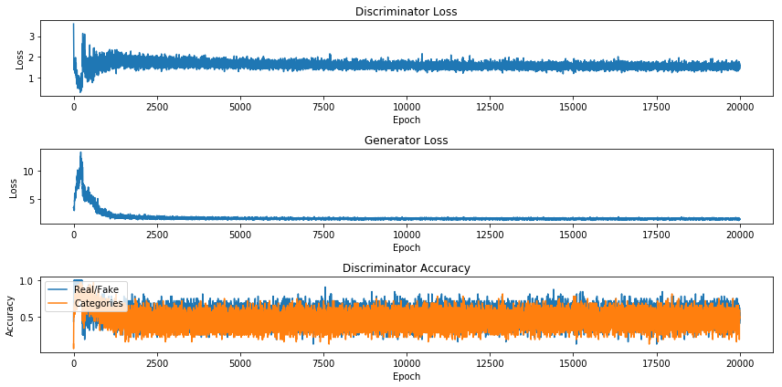

# MNIST-GAN

The below images of digits are generated using an Auxiliary Classifier Generative Adversarial Network (AC-GAN) that creates a network using the <a href="http://yann.lecun.com/exdb/mnist/">MNIST</a> data set.

There is a generator network that takes in random noise and a class label (0-9), and generates an appopriate image. 
#### Generator model structure
  
There is a discriminator network that takes an image as input and decides whether it is real or fake and also tries to predict which digit it is.
#### Discriminator model structure
  
   

These networks trade off loss on one another so when the discriminator is good at determining class labels, the generator will have to make images more like those in the MNIST set. When the generator gets good at creating images that look like ones in the MNIST set, the discriminator will have to be more careful about which class label/digit to choose. 
  
